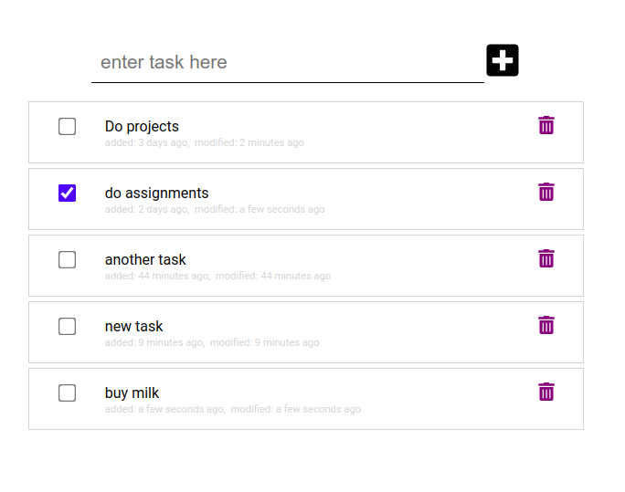

# Todo Full Stack

 

## The Stack

## Features
The features of the application include:
- Add new task
- Remove a task
- Update a task
- Check all the tasks 

## Design
The design of the app is kept ergonomic with the following implementations:
- Effortlessly add a task by just typing and pressing enter
- Remove a task by clicking the recycle bin button
- Check a task to mark it 'done'
- Click on the name of task to edit it

## Screenshot
